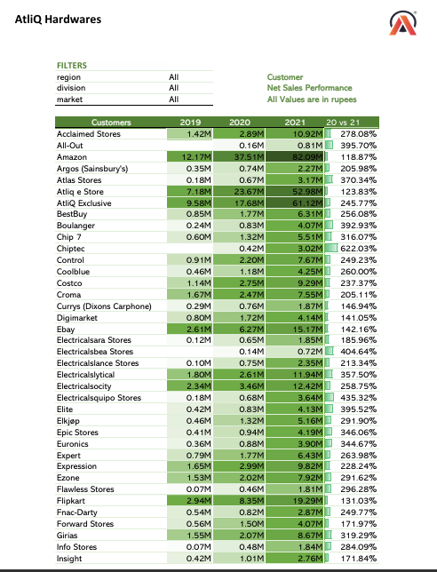
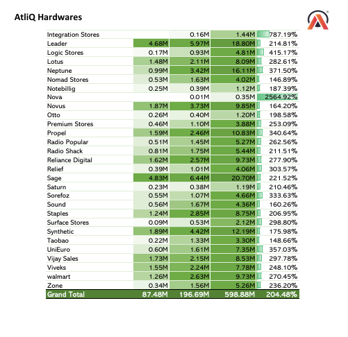

# Sales & Finance Analytics using Microsoft Excel
---
## Project Overview
This project analyzes sales and financial performance using Microsoft Excel. The objective is to generate meaningful business insights through data analysis and interactive reports.

---
**
About Company :
AtliQ Hardware is a multinational company that sells products such as printers, mice, PCs, etc., to two customer types: e-commerce platforms (e.g., Amazon, Flipkart) and brick-and-mortar stores (e.g., Croma, Best Buy). The company uses three sales channels:
---

Retailer: Croma, Amazon
Distributor: Neptune
Direct Channel: AtliQ e Store, AtliQ Exclusive
---**

## Project Objective :

The primary goal of this project is to analyze AtliQ Hardware's sales and financial performance from 2019 to 2021. This analysis will support the company in making informed decisions for growth, identifying sales trends, and evaluating market performance. The fiscal year for AtliQ Hardware runs from September to August.

---

## Techniques used :-

ETL Process with Power Query :
Extracted data from multiple sources, cleaned inconsistent values, fixed headers, and transformed negative quantities into absolute values.

Date Table Creation :
Built a dedicated Date Table in Power Query to ensure unique dates for accurate time-based analysis.

Fiscal Calendar Setup :
Derived fiscal months and quarters in Power Pivot to align reporting with AtliQ Hardware’s fiscal year.

Data Modeling :
Created relationships between fact and dimension tables using Power Pivot for structured and reliable data analysis.

Supplementary Data Integration :
Added additional datasets into the model through Power Pivot to enhance overall insights.

DAX Calculations :
Used DAX to build dynamic calculated columns and measures for deeper analytical flexibility.

Pivot Table Reporting :
Designed Pivot Tables to summarize sales and financial performance effectively.

Conditional Formatting :
Applied conditional formatting to highlight key trends, variances, and important metrics

---

📊 Key Business Insights
1. Net Sales Growth
   
Overall net sales increased from ₹87.48M (2019) to ₹196.69M (2020) and reached ₹598.88M (2021).
The company achieved an impressive 204.48% growth in 2021 compared to 2020.
Most customers experienced significant year-over-year sales growth, with several customers recording more than 300% growth.

### Customer Net Sales Performance (Part 1)

### Customer Net Sales Performance (Part 2)
.

---

2. Division Performance

Division	Growth (2021 vs 2020)
PC	313.70%
P & A	221.53%
N & S	84.38%
Insight
PC Division was the fastest-growing business segment.
P & A remained the largest revenue contributor.
N & S showed positive but comparatively slower growth.
### Division Sales Report

---

3. Customer Performance

Customers such as Amazon, AtliQ Exclusive, Flipkart, Reliance Digital, Croma, and Vijay Sales generated substantial revenue growth.
India became one of the strongest performing markets with ₹161.26M in net sales during 2021.

### India Market Performance

---

4. Gross Margin Analysis

year 2019	- gross margin 41.43%

year 2020- gross margin 37.28%

year 2021-gross margin36.43%

Insight

Although revenue increased dramatically, the Gross Margin % declined every year.
This indicates that sales were growing faster than profitability, suggesting increased production costs, pricing pressure, or higher discounts.

---

5. Quarterly Profit & Loss

Net sales consistently increased across all quarters from 2019 to 2021.
Gross margin value increased significantly because of higher sales.
However, Gross Margin % remained relatively stable within each year but declined overall across years.

### Gross Margin % (2019)

### Gross Margin % (2020)

### Gross Margin % (2021)

---
6.Profit and Loss by Fiscal Year

Net Sales increased significantly from ₹87.48M (2019) to ₹196.69M (2020) and reached ₹598.88M (2021), representing an impressive 204% year-over-year growth in 2021.
Cost of Goods Sold (COGS) also grew substantially, rising from ₹51.24M in 2019 to ₹380.71M in 2021, reflecting increased production and sales volume.
Gross Margin (Value) improved from ₹36.24M in 2019 to ₹218.16M in 2021, indicating strong growth in absolute profit despite higher operating costs.
Gross Margin Percentage (GM%) declined from 41.43% (2019) to 37.28% (2020) and further to 36.43% (2021), showing that profitability per unit of sales decreased even as revenue expanded.
While the company experienced exceptional revenue growth, the declining GM% suggests increasing costs, pricing pressure, or higher discounts, highlighting an opportunity to improve operational efficiency and profit margins.

### Profit & Loss by Fiscal Year

---

7. Country Performance vs Target

Most countries failed to achieve their 2021 sales targets.
Overall company performance finished approximately 9.17% below target.
Countries with the highest shortfall require additional sales and marketing focus.

---

8. Product Analysis

Best Performing Products
AQ Master Wireless X1 MS
AQ Master Wired X1 MS
AQ Gamers Series

These products contributed the highest sales volume.

Lowest Performing Products
AQ Home Allin1 Gen 2
AQ Home Allin1
AQ Smash 2

These products showed very low demand and may require product redesign, marketing improvements, or discontinuation analysis.
### Top & Bottom 5 Products

---
##🎯 Business Recommendations

Continue investing in the PC and P & A divisions, which are driving business growth.

Improve profitability by reducing costs and optimizing pricing strategies to increase Gross Margin %.

Investigate why multiple countries failed to meet sales targets and develop region-specific sales strategies.

Strengthen relationships with high-performing customers while creating engagement plans for underperforming ones.

Increase inventory and marketing support for best-selling products and reassess low-performing product lines.

Monitor Gross Margin quarterly to ensure rapid sales growth translates into sustainable profitability.

---

##📌 Project Conclusion

This Excel project demonstrates how advanced Excel features—including Power Query, Power Pivot, DAX Measures, Pivot Tables, Conditional Formatting, Interactive Filters, and Dashboard Design—can transform raw transactional data into actionable business insights.

The analysis revealed that AtliQ Hardware achieved exceptional revenue growth between 2019 and 2021, with net sales increasing by over 204% in 2021. However, despite this strong top-line performance, the Gross Margin % steadily declined, highlighting the importance of balancing growth with profitability. The dashboards also identified high-performing divisions, customers, products, and regions while uncovering markets that fell short of sales targets.

Overall, this project showcases my ability to perform end-to-end business analysis in Excel, build interactive dashboards, interpret KPIs, and convert data into meaningful recommendations that support strategic business decision-making.
---

## Tools Used
- Microsoft Excel
- Pivot Tables
- Power Pivot
- Power Query
- DAX Measures
- Charts & Visualizations

---

## Key Features
- Sales Performance Analysis
- Net Sales Analysis
- Profit & Loss Report
- Customer Performance Analysis
- Market-wise Analysis
- KPI Reporting
- ---

## Skills Demonstrated
- Data Cleaning
- Data Modeling
- Pivot Tables
- Power Pivot
- DAX
- Business Analysis
- Dashboard Design
---
## Project Outcome
Developed interactive analytical reports that help monitor sales performance, profitability, and customer trends for business decision-making.

